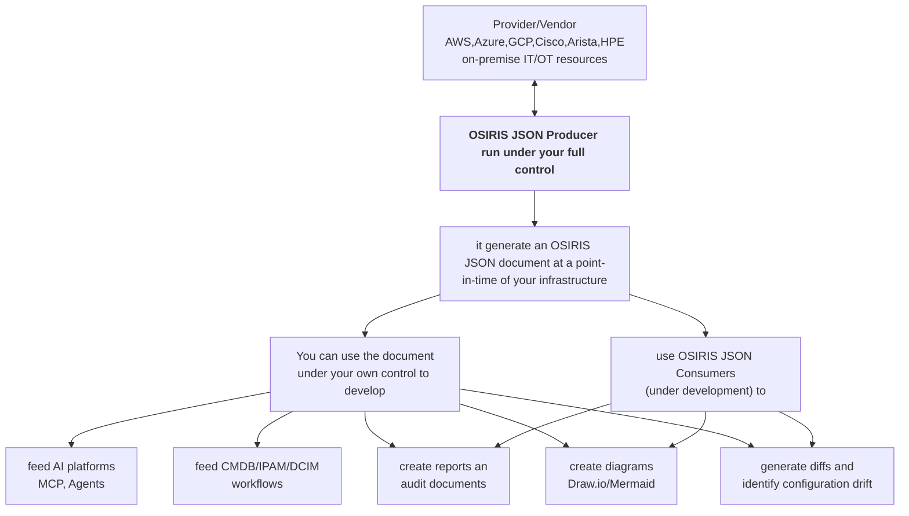

# OSIRIS JSON Producers

Monorepo for the OSIRIS JSON producers.

## What is an OSIRIS JSON producer?

an OSIRIS JSON producer **generates a private snapshot of your infrastructure** at a point in time **without need** to connect to any third-party service or AI Platforms and MCP Servers. **You execute it fully under your complete control.**

It connects directly **from your own environment** to infrastructure sources such as hyperscalers, public cloud and hosting providers, on-premise IT systems (like for example hypervisors,bare metal servers,storage,network etc.) and OT systems. It discovers inventory and topology data, normalizes proprietary informations and emits a valid OSIRIS JSON Document like [OSIRIS JSON IT infrastructure example](https://osirisjson.org/en/docs/examples/01-it-infrastructure) and [OSIRIS JSON OT infrastructure example](https://osirisjson.org/en/docs/examples/02-ot-infrastructure).

- **No** AI platform, MCP server or AI agent are required
- **No** SaaS or intermediary API are required
- **No** pay per use or expensive consultancy are required
- **No** additional software development is required
- Your infrastructure data stays under your control like your API keys and credentials to retrieve the informations and generate an OSIRIS JSON document

[OSIRIS JSON producer](https://osirisjson.org/en/docs/producers/getting-started) bridge the gap between proprietary infrastructure language/format and the freedom of an open, vendor-neutral JSON format.

### Available producers

| OSIRIS JSON Producer | Category | Status |
|---|---|---|
| Amazon AWS | Hyperscaler | [Available](https://osirisjson.org/en/docs/producers/hyperscalers/amazon-aws) |
| Microsoft Azure | Hyperscaler | [Available](https://osirisjson.org/en/docs/producers/hyperscalers/microsoft-azure) |
| Google Cloud Platform | Hyperscaler | [Under development](https://osirisjson.org/en/docs/roadmap/01-2026) |
| Cloudflare | Hyperscaler | Planned |
| Oracle | Hyperscaler | To be planned |
| IBM | Hyperscaler | To be planned |
| Alibaba | Hyperscaler | To be planned |
| Digital Ocean | Hosting and Cloud Providers | To be planned |
| Leaseweb | Hosting and Cloud Providers | To be planned |
| Hetzner | Hosting and Cloud Providers | To be planned |
| OVH | Hosting and Cloud Providers | To be planned |

For the full roadmap, visit [https://osirisjson.org/en/docs/roadmap/01-2026](https://osirisjson.org/en/docs/roadmap/01-2026)

## Install

| Platform | Action |
|---|---|
| Linux | |
| macOS | `brew tap osirisjson/osiris-producers && brew install osirisjson-producer` |
| Windows | download a pre-built binary from the [Releases page](https://github.com/osirisjson/osiris-producers/releases/latest) |
| Go installed (any platform) | `go install go.osirisjson.org/producers/cmd/...@latest` |

See [INSTALL.md](INSTALL.md) for full instructions including deb/rpm packages, checksum verification, and platform-specific notes.

## Documentation
For full documentation, visit [osirisjson.org/en/docs/producers/getting-started](http://osirisjson.org/en/docs/producers/getting-started).

## Issues
If you encounter an issue with the project, you are welcome to submit an [issue](https://github.com/osirisjson/osiris-producers/issues).

## Contribute

End-to-end infrastructure visibility [SHOULD NOT](https://datatracker.ietf.org/doc/html/rfc2119) depend on tribal knowledge, expensive consultancy, overhead licenses or closed/privacy-risk third-party tooling/platforms.

If you believe infrastructure documentation [SHOULD](https://datatracker.ietf.org/doc/html/rfc2119) be open, standardized, private, repeatable and accessible to everyone, contributions of any size is warmly welcomed: questions, clarifications, examples, reviews, documentation improvements, producers, consumers, and tooling ideas.

As an open-source project, [OSIRIS JSON](https://osirisjson.org/en) is happy to support contributors with guidance on pull requests, technical writing, examples, and feature design.

Visit [osirisjson.org/en/docs/get-involved/community](https://osirisjson.org/en/docs/get-involved/community)