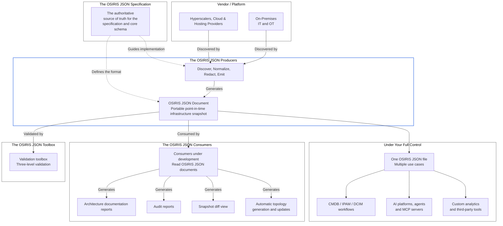

# The OSIRIS JSON Producers

An **OSIRIS JSON Producer** is a lightweight, read-only program written in Go that runs on your workstation or server. It connects directly to supported infrastructure environments, discovers resources and relationships, normalizes vendor-specific data, redacts sensitive values, and generates a portable OSIRIS JSON document representing the infrastructure at a specific point in time.

*In this demo it's connecting to AWS account and generating an OSIRIS JSON document*

### The OSIRIS JSON Manifesto in practice

End-to-end infrastructure visibility should not depend on tribal knowledge, expensive consultancy, or closed and proprietary external platforms.

When you run an OSIRIS JSON Producer:

* No AI platform, MCP server, or external agent is required.
* No SaaS subscription or intermediary service is required.
* The OSIRIS JSON producer runs within an environment you fully control.
* Credentials and authentication material are excluded from the generated document.
* Operational logs provide clear visibility into discovery, normalization, redaction, and emission.

*The generated OSIRIS JSON document remains local unless you decide to move, integrate, or share it. **You alone determine how it is used**.*

[Read the OSIRIS JSON Manifesto](https://osirisjson.org/en/commitments/manifesto)

---

### Architecture workflow

---

### Available producers

| OSIRIS JSON Producer | Category | Status |
|---|---|---|
| **Amazon AWS** | Hyperscaler | [Available](https://docs.osirisjson.org/osiris-producers/hyperscalers/amazon-aws/) |
| **Microsoft Azure** | Hyperscaler | [Available](https://docs.osirisjson.org/osiris-producers/hyperscalers/microsoft-azure/) |
| **Google Cloud** | Hyperscaler | [Under development](https://osirisjson.org/en/commitments/roadmap) |
| **HPE Aruba Central** | Network | [Available](https://docs.osirisjson.org/osiris-producers/network/hpe-aruba-networking-central) |
| **Cisco** | Network | [Available](https://docs.osirisjson.org/osiris-producers/network/cisco/) |
| **Cloudflare** | Hyperscaler | Planned |
| **Proxmox VE** | Hypervisor | [Under development](https://osirisjson.org/en/commitments/roadmap) |

*For the complete roadmap, visit [osirisjson.org/en/commitments/roadmap](https://osirisjson.org/en/commitments/roadmap).*

### Installation

See the official guidelines available on [docs.osirisjson.org/osiris-producers/installation](https://docs.osirisjson.org/osiris-producers/installation/)

### Documentation and contribution

- [OSIRIS JSON Producer Development Guidelines](https://docs.osirisjson.org/developer-guidelines/producers/producer-guidelines/)
- [Community & contribution guidelines](https://docs.osirisjson.org/community/contributing/)